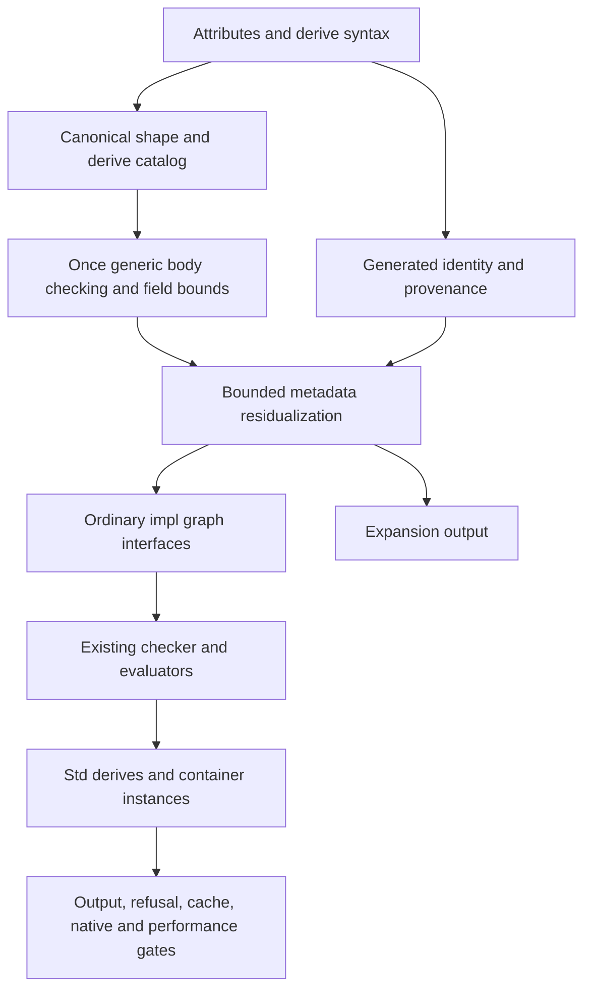

# Complete Derive integration

## Authorization and state

The user requests complete [[Derive Design]] implementation, continuing the
uncommitted frontend work on `feature/430-derive-frontend`. Preserve every pending
change. The latest instruction permits focused commits as soon as tests pass, while prohibiting PRs or review requests.
The preceding MultiMap repair is delivered separately as 71fb2adf.

## Roles and ownership

Language Architect resolves the integration contracts in [[Derive Design]] before
implementation. Architect → Frontend Engineer: parser/AST/traversal correctness and
frontend tests, preserving the existing issue #430 work. Architect → Semantic
Engineer: generic derive validation, bound proof, metadata typing, static trait
selection, graph phase integration and cache invalidation. Architect → Expansion
Engineer: new residualization modules, canonical derive catalog, field/variant
metadata elimination and generated impl construction. Architect → Stdlib Engineer:
ordinary Meta facade, seven library derives and their required ordinary traits and
container instances. Architect → Tooling Engineer: span provenance, CLI expansion,
benchmarks, integration tests and coordinated registration/docs.

Each implementation worker reads complete mirrored pages before editing and writes
complete mirrors with resolved Grill Logs before creating a module. Workers are
not alone and preserve unrelated edits. Cabal, MOCs, this handoff and changelog are
owned by the integration owner; workers report their required additions.

## Dependency layers

## Required evidence

All shipped derives cover records, sums where applicable, generics, recursive
values and attributes. Definition errors appear once even without a request.
Missing field bounds point at the field with the request note. No Meta call or
compile-time loop reaches runtime. Imports, aliases, coherence, generic nested
bounds, budgets, distinct generated literal identities, cache invalidation and
source provenance receive focused regression checks. Derived JSON encoding is
compared to handwritten encoding with the same data and evaluation modes.

## Exact next action

Complete the mirrored Std.Meta facade and loaded-program typing properties for
its owner-specific Field/Variant accessors before residualization. Canonical derive
member contracts, loop source typing, nested rigid bounds and isolated obligations
pass the full optimized suite (516 properties, `-Werror`, 2026-10-02). The preceding
resolution and parser slices are committed as 81fd9860 and 9c1d7ea5.

Remaining integration includes trait-head kind/bound proofs, callback `where`
binders and typed reflection, macro traversal/hygiene, generated identity and
provenance, graph residualization before interfaces, recursive field-bound proofs,
cache invalidation, generic static trait calls, all shipped library derives,
expansion output and JSON performance evidence. The complete feature is not ready
for dev; no PR or review request is authorized yet.

## Referenced by

[[handoffs/_MOC]] · [[Derive Design]] · [[Engineering Delivery]]

## Solo hardening continuation

2026-10-02: all implementation and validation are owned by one integration
engineer. No sub-agents run. Authoritative ticket scopes are #432 resolution,
#433 generic checking, #431 complete integration and #430 frontend; #434 tracks
Meta groundwork. Preserve unrelated desktop metadata files and existing user
changes. Commit each validated improvement without opening a PR.

Architect → Semantic Engineer: own canonical contract validation, shared rigid
substitution and scoped loop checking in Type.Check.Derive, Type.Substitute,
Type.Env, Type.Check/Expression/Rule and their focused specs. No other agent owns
these files. Existing Source/Diagnostic provenance contracts and the untracked
Meta prototype remain pending their implementation layers.

Definition scale evidence: temporary generated modules containing 500, 1,000,
2,000 and 4,000 independent user traits and derives checked with zero diagnostics
in 0.025, 0.086, 0.151 and 0.284 seconds of CPU time using the optimized compiler
library. The harness imports Type.Check.Derive to pin this implementation. These
numbers cover definition checking; generated impl/JSON runtime measurements remain
required. The scratch harness and logs live outside the repository.
