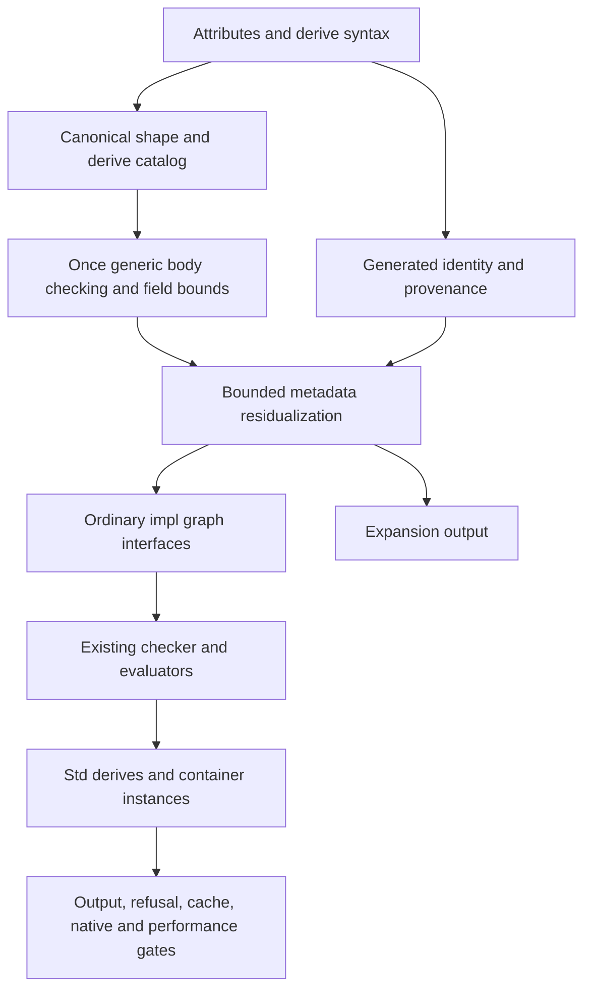

# Complete Derive integration

## Authorization and state

The user requests complete [[Derive Design]] implementation, continuing the
uncommitted frontend work on `feature/430-derive-frontend`. Preserve every pending
change. The latest instruction permits focused commits as soon as tests pass, while prohibiting PRs or review requests.
The preceding MultiMap repair is delivered separately as 71fb2adf.

## Roles and ownership

Language Architect resolves the integration contracts in [[Derive Design]] before
implementation. Architect → Frontend Engineer: parser/AST/traversal correctness and
frontend tests, preserving the existing issue #430 work. Architect → Semantic
Engineer: generic derive validation, bound proof, metadata typing, static trait
selection, graph phase integration and cache invalidation. Architect → Expansion
Engineer: new residualization modules, canonical derive catalog, field/variant
metadata elimination and generated impl construction. Architect → Stdlib Engineer:
ordinary Meta facade, seven library derives and their required ordinary traits and
container instances. Architect → Tooling Engineer: span provenance, CLI expansion,
benchmarks, integration tests and coordinated registration/docs.

Each implementation worker reads complete mirrored pages before editing and writes
complete mirrors with resolved Grill Logs before creating a module. Workers are
not alone and preserve unrelated edits. Cabal, MOCs, this handoff and changelog are
owned by the integration owner; workers report their required additions.

## Dependency layers

## Required evidence

All shipped derives cover records, sums where applicable, generics, recursive
values and attributes. Definition errors appear once even without a request.
Missing field bounds point at the field with the request note. No Meta call or
compile-time loop reaches runtime. Imports, aliases, coherence, generic nested
bounds, budgets, distinct generated literal identities, cache invalidation and
source provenance receive focused regression checks. Derived JSON encoding is
compared to handwritten encoding with the same data and evaluation modes.

## Exact next action

Collect canonical derive requests and validated definitions at the graph boundary,
then prove field obligations before publishing generated heads into interfaces.
Retain the defining module's lexical context for imported templates. Callback
`where`, rank-polymorphic and Result-valued construction remain required next.
Std.Meta declarations, owner-specific accessors, heterogeneous sequences and
canonical implicit field-parameter binding now have loaded-program evidence.
Shared receiver specialization fixes the underlying generic-method owner/result
hole for direct and captured calls. The full optimized suite passes 519 properties
with `-Werror` on GHC 9.10.3 (2026-10-03); CLI checks and formatting pass.

Remaining integration includes trait-head kind/bound proofs, callback `where`
binders and typed reflection, macro traversal/hygiene,
graph residualization before interfaces, recursive field-bound proofs,
cache invalidation, generic static trait calls, all shipped library derives,
expansion output and JSON performance evidence. The complete feature is not ready
for dev; no PR or review request is authorized yet.

## Referenced by

[[handoffs/_MOC]] · [[Derive Design]] · [[Engineering Delivery]]

## Solo hardening continuation

2026-10-03: Architect → Semantic/Stdlib Engineer owns Std.Meta, Type.Check.Reflection,
loop integration, canonical implicit field-parameter resolution, loaded reflection
specs and registration. Reflection sequences use opaque Fields[T]/Variants[T],
because a homogeneous Array erases heterogeneous field identity. No sub-agents
participate. Complete metadata elimination and polymorphic/Result construction
remain required; declaration groundwork does not claim complete delivery.

The reflection continuation preserves Source/Diagnostic provenance plans without
changing or staging their pending mirrors. Meta panic bodies remain declarations
only: runtime elimination and polymorphic/Result builders are not delivered.
The renewed active goal authorizes committing each passing checkpoint on
`feature/430-derive-frontend`, without a PR or review request. Checkpoint the
validated reflection slice; preserve the pending Source/Diagnostic mirrors for
the generated-identity layer. The complete integration remains off dev.
Focused loaded-module matrices and existing built-in implementation compatibility
pass. A complete compiler definition benchmark with 500/1,000/2,000/4,000 user
derives containing Meta loops reports 0.115/0.177/0.350/0.666 seconds CPU and no
diagnostics; generated implementation/runtime performance remains unmeasured.

2026-10-02: all implementation and validation are owned by one integration
engineer. No sub-agents run. Authoritative ticket scopes are #432 resolution,
#433 generic checking, #431 complete integration and #430 frontend; #434 tracks
Meta groundwork. Preserve unrelated desktop metadata files and existing user
changes. Commit each validated improvement without opening a PR.

Architect → Semantic Engineer: own canonical contract validation, shared rigid
substitution and scoped loop checking in Type.Check.Derive, Type.Substitute,
Type.Env, Type.Check/Expression/Rule and their focused specs. No other agent owns
these files. Existing Source/Diagnostic provenance contracts and the untracked
Meta prototype remain pending their implementation layers.

Definition scale evidence: temporary generated modules containing 500, 1,000,
2,000 and 4,000 independent user traits and derives checked with zero diagnostics
in 0.025, 0.086, 0.151 and 0.284 seconds of CPU time using the optimized compiler
library. The harness imports Type.Check.Derive to pin this implementation. These
numbers cover definition checking; generated impl/JSON runtime measurements remain
required. The scratch harness and logs live outside the repository.

2026-10-03: Architect → Tooling/Semantic Engineer owns Source, Diagnostic,
Type/Env/Check/Boundary, Semantic writable spans, Cache.Persist, Repl.Evaluation
and GeneratedIdentitySpec. Resolve full fact identity before residualization:
compact generated anchors, full-span checker keys, authored-only editor index,
central diagnostic notes and conservative persistence misses. No other agents run.

Architect → Expansion Engineer owns Derive.Record/State and Comptime.Limits,
a pure record residualization kernel producing ordinary impl syntax and located
field proof requests. The graph must consume validated templates, prove requests
and publish heads before interfaces; the kernel does not stand in for that gate.
This work is solo and preserves the complete Sum/build/Std delivery requirements.

Tooling ownership additionally includes Lsp.PatternCompletion: repaired source
prefixes deliberately query the authored offset index, while exact compiler
lookups preserve full identity. Existing served/unfinished completion regressions
exposed this projection boundary during the full-suite gate.

Generated identity checkpoint: full optimized suite passes 523 property families
with -Werror on GHC 9.10.3. Focused completion repair tests also pass. Source,
checker, editor projection, central provenance and conservative persistence are
verified together. Record residualization initially remained unregistered while
its generated-code checks were being implemented; the following checkpoint
supersedes that state.

Expansion/Runtime ownership includes Eval.Env, Eval.Loop and Eval.MultiMap.Kernel
only for importing the phase-neutral existing depth and iteration constants.
Runtime loop semantics and thresholds remain unchanged; no new optimization is
introduced through this shared-boundary extraction.

Expansion/Tooling ownership includes Syntax.Provenance and Compiler.Cache storage
only. Deferred declarations can hide a generated-span marker until execution;
validate every authored snapshot before writing a checked product. Do not alter
ordinary warm-reader laziness or use byte-pattern scanning as provenance proof.

Record kernel checkpoint: all four loaded-program property families pass in tree
and compiled evaluation, including actual heterogeneous reads, mutable writes,
strict fallback effects, generic targets and lexical shadowing. The full optimized
suite passes 528 families with -Werror on GHC 9.10.3. Deferred syntax and fact keys
are refused before cache storage when provenance cannot be restored. Ordinary
cache products still restore complete function bodies. Kernel expansion of
500/1,000/2,000/4,000 fields takes 0.0003/0.0004/0.0006/0.0019 seconds CPU,
excluding checking and execution. No real CLI request expansion or complete
delivery is claimed. Exact next action is the graph catalog and field-proof
publication gate described above.

Architect → Semantic Engineer owns Type.Implementation, Type.Proof, declaration
collection, checker state access, obligation/dynamic consumers and their focused
specs. Preserve concrete heads and conditional bounds before graph publication:
the existing owner-only relation incorrectly admits incompatible applications.
This work is solo; full derive integration remains the active objective.

Architect → Semantic/Tooling Engineer: extend solo ownership to Type.Value, Check.Signature/Rule/Statement/Expression/Derive/Check and Doc.Signature for complete application evidence across shared Scheme, scoped bounds, call obligations, rigid method selection and signature rendering. Preserve existing inference and diagnostic boundaries. No other agents participate.

Semantic ownership also covers Type.Check.Call for canonical qualified selection
on rigid receivers, sharing full scoped bound specialization with member access.

Tooling ownership includes Doc.Json's existing bound-string protocol projection;
internal full bound shapes preserve alpha equivalence and public rendering.

Semantic ownership extends to Resolve's generic-header binding order so explicit
constructor applications and forward bound parameters resolve in their own scope.
Value-parameter/default activation remains unchanged; the generic header tests
verify missing and duplicate type names remain diagnostics.

2026-10-04: conditional trait-evidence checkpoint passes all 537 property
families, optimized build with -Werror, CLI tree/compiled output parity,
formatter checks and diagnostic-code validation on GHC 9.10.3. Unique inference
returns proposals without mutating the caller during proof; full method-bound
applications and documentation retain their arguments. A 1,000-layer proof takes
0.0104s CPU. Generic type-argument count/kind validation at the declaration still
needs completion before graph field-proof publication. The renewed goal permits
committing passing checkpoints; no PR, review request or dev promotion yet.
