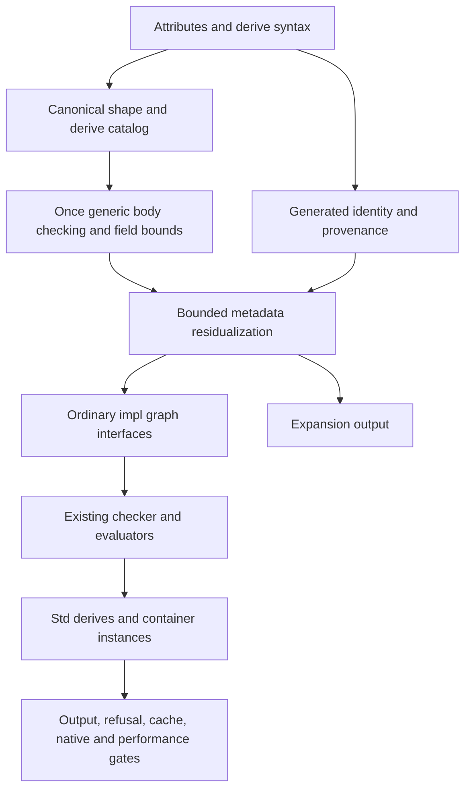

# Complete Derive integration

## Authorization and state

The user requests complete [[Derive Design]] implementation, continuing the
uncommitted frontend work on `feature/430-derive-frontend`. Preserve every pending
change. The latest instruction permits focused commits as soon as tests pass, while prohibiting PRs or review requests.
The preceding MultiMap repair is delivered separately as 71fb2adf.

## Roles and ownership

Language Architect resolves the integration contracts in [[Derive Design]] before
implementation. Architect → Frontend Engineer: parser/AST/traversal correctness and
frontend tests, preserving the existing issue #430 work. Architect → Semantic
Engineer: generic derive validation, bound proof, metadata typing, static trait
selection, graph phase integration and cache invalidation. Architect → Expansion
Engineer: new residualization modules, canonical derive catalog, field/variant
metadata elimination and generated impl construction. Architect → Stdlib Engineer:
ordinary Meta facade, seven library derives and their required ordinary traits and
container instances. Architect → Tooling Engineer: span provenance, CLI expansion,
benchmarks, integration tests and coordinated registration/docs.

Each implementation worker reads complete mirrored pages before editing and writes
complete mirrors with resolved Grill Logs before creating a module. Workers are
not alone and preserve unrelated edits. Cabal, MOCs, this handoff and changelog are
owned by the integration owner; workers report their required additions.

## Dependency layers

## Required evidence

All shipped derives cover records, sums where applicable, generics, recursive
values and attributes. Definition errors appear once even without a request.
Missing field bounds point at the field with the request note. No Meta call or
compile-time loop reaches runtime. Imports, aliases, coherence, generic nested
bounds, budgets, distinct generated literal identities, cache invalidation and
source provenance receive focused regression checks. Derived JSON encoding is
compared to handwritten encoding with the same data and evaluation modes.

## Exact next action

Collect canonical derive requests and validated definitions at the graph boundary,
then prove field obligations before publishing generated heads into interfaces.
Retain the defining module's lexical context for imported templates. Callback
`where`, rank-polymorphic and Result-valued construction remain required next.
Std.Meta declarations, owner-specific accessors, heterogeneous sequences and
canonical implicit field-parameter binding now have loaded-program evidence.
Shared receiver specialization fixes the underlying generic-method owner/result
hole for direct and captured calls. The full optimized suite passes 519 properties
with `-Werror` on GHC 9.10.3 (2026-10-03); CLI checks and formatting pass.

Remaining integration includes trait-head kind/bound proofs, callback `where`
binders and typed reflection, macro traversal/hygiene,
graph residualization before interfaces, recursive field-bound proofs,
cache invalidation, generic static trait calls, all shipped library derives,
expansion output and JSON performance evidence. The complete feature is not ready
for dev; no PR or review request is authorized yet.

## Referenced by

[[handoffs/_MOC]] · [[Derive Design]] · [[Engineering Delivery]]

## Solo hardening continuation

2026-10-03: Architect → Semantic/Stdlib Engineer owns Std.Meta, Type.Check.Reflection,
loop integration, canonical implicit field-parameter resolution, loaded reflection
specs and registration. Reflection sequences use opaque Fields[T]/Variants[T],
because a homogeneous Array erases heterogeneous field identity. No sub-agents
participate. Complete metadata elimination and polymorphic/Result construction
remain required; declaration groundwork does not claim complete delivery.

The reflection continuation preserves Source/Diagnostic provenance plans without
changing or staging their pending mirrors. Meta panic bodies remain declarations
only: runtime elimination and polymorphic/Result builders are not delivered.
The renewed active goal authorizes committing each passing checkpoint on
`feature/430-derive-frontend`, without a PR or review request. Checkpoint the
validated reflection slice; preserve the pending Source/Diagnostic mirrors for
the generated-identity layer. The complete integration remains off dev.
Focused loaded-module matrices and existing built-in implementation compatibility
pass. A complete compiler definition benchmark with 500/1,000/2,000/4,000 user
derives containing Meta loops reports 0.115/0.177/0.350/0.666 seconds CPU and no
diagnostics; generated implementation/runtime performance remains unmeasured.

2026-10-02: all implementation and validation are owned by one integration
engineer. No sub-agents run. Authoritative ticket scopes are #432 resolution,
#433 generic checking, #431 complete integration and #430 frontend; #434 tracks
Meta groundwork. Preserve unrelated desktop metadata files and existing user
changes. Commit each validated improvement without opening a PR.

Architect → Semantic Engineer: own canonical contract validation, shared rigid
substitution and scoped loop checking in Type.Check.Derive, Type.Substitute,
Type.Env, Type.Check/Expression/Rule and their focused specs. No other agent owns
these files. Existing Source/Diagnostic provenance contracts and the untracked
Meta prototype remain pending their implementation layers.

Definition scale evidence: temporary generated modules containing 500, 1,000,
2,000 and 4,000 independent user traits and derives checked with zero diagnostics
in 0.025, 0.086, 0.151 and 0.284 seconds of CPU time using the optimized compiler
library. The harness imports Type.Check.Derive to pin this implementation. These
numbers cover definition checking; generated impl/JSON runtime measurements remain
required. The scratch harness and logs live outside the repository.

2026-10-03: Architect → Tooling/Semantic Engineer owns Source, Diagnostic,
Type/Env/Check/Boundary, Semantic writable spans, Cache.Persist, Repl.Evaluation
and GeneratedIdentitySpec. Resolve full fact identity before residualization:
compact generated anchors, full-span checker keys, authored-only editor index,
central diagnostic notes and conservative persistence misses. No other agents run.

Architect → Expansion Engineer owns Derive.Record/State and Comptime.Limits,
a pure record residualization kernel producing ordinary impl syntax and located
field proof requests. The graph must consume validated templates, prove requests
and publish heads before interfaces; the kernel does not stand in for that gate.
This work is solo and preserves the complete Sum/build/Std delivery requirements.

Tooling ownership additionally includes Lsp.PatternCompletion: repaired source
prefixes deliberately query the authored offset index, while exact compiler
lookups preserve full identity. Existing served/unfinished completion regressions
exposed this projection boundary during the full-suite gate.

Generated identity checkpoint: full optimized suite passes 523 property families
with -Werror on GHC 9.10.3. Focused completion repair tests also pass. Source,
checker, editor projection, central provenance and conservative persistence are
verified together. Record residualization initially remained unregistered while
its generated-code checks were being implemented; the following checkpoint
supersedes that state.

Expansion/Runtime ownership includes Eval.Env, Eval.Loop and Eval.MultiMap.Kernel
only for importing the phase-neutral existing depth and iteration constants.
Runtime loop semantics and thresholds remain unchanged; no new optimization is
introduced through this shared-boundary extraction.

Expansion/Tooling ownership includes Syntax.Provenance and Compiler.Cache storage
only. Deferred declarations can hide a generated-span marker until execution;
validate every authored snapshot before writing a checked product. Do not alter
ordinary warm-reader laziness or use byte-pattern scanning as provenance proof.

Record kernel checkpoint: all four loaded-program property families pass in tree
and compiled evaluation, including actual heterogeneous reads, mutable writes,
strict fallback effects, generic targets and lexical shadowing. The full optimized
suite passes 528 families with -Werror on GHC 9.10.3. Deferred syntax and fact keys
are refused before cache storage when provenance cannot be restored. Ordinary
cache products still restore complete function bodies. Kernel expansion of
500/1,000/2,000/4,000 fields takes 0.0003/0.0004/0.0006/0.0019 seconds CPU,
excluding checking and execution. No real CLI request expansion or complete
delivery is claimed. Exact next action is the graph catalog and field-proof
publication gate described above.

Architect → Semantic Engineer owns Type.Implementation, Type.Proof, declaration
collection, checker state access, obligation/dynamic consumers and their focused
specs. Preserve concrete heads and conditional bounds before graph publication:
the existing owner-only relation incorrectly admits incompatible applications.
This work is solo; full derive integration remains the active objective.

Architect → Semantic/Tooling Engineer: extend solo ownership to Type.Value, Check.Signature/Rule/Statement/Expression/Derive/Check and Doc.Signature for complete application evidence across shared Scheme, scoped bounds, call obligations, rigid method selection and signature rendering. Preserve existing inference and diagnostic boundaries. No other agents participate.

Semantic ownership also covers Type.Check.Call for canonical qualified selection
on rigid receivers, sharing full scoped bound specialization with member access.

Tooling ownership includes Doc.Json's existing bound-string protocol projection;
internal full bound shapes preserve alpha equivalence and public rendering.

Semantic ownership extends to Resolve's generic-header binding order so explicit
constructor applications and forward bound parameters resolve in their own scope.
Value-parameter/default activation remains unchanged; the generic header tests
verify missing and duplicate type names remain diagnostics.

2026-10-04: conditional trait-evidence checkpoint passes all 537 property
families, optimized build with -Werror, CLI tree/compiled output parity,
formatter checks and diagnostic-code validation on GHC 9.10.3. Unique inference
returns proposals without mutating the caller during proof; full method-bound
applications and documentation retain their arguments. A 1,000-layer proof takes
0.0104s CPU. Generic type-argument count/kind validation at the declaration still
needs completion before graph field-proof publication. The renewed goal permits
committing passing checkpoints; no PR, review request or dev promotion yet.

Architect → Semantic Engineer owns Type.Check.Bound, Check/Expression hooks,
Formation's constructor-argument positions and ImplementationSpec admission
matrices. Validate full bound arity and kinds at the definition before graph
publication. Preserve existing canonical formation and declaration diagnostics;
no sub-agents participate. A passing proof checkpoint is committed as 351c9861.

Semantic ownership includes Pattern's shared substitution, the Record consumer,
Unify's complete constructor applications and TraitSpec's inspected diagnostic
delta. Keep valid higher-kind aggregate inference and refuse partial heads.

The user additionally requests whole-compiler benchmarking and GitHub Actions
latency improvements. Preserve Derive as the active integration work while the
Tooling/Performance role measures Haskell build, Pudu checking and execution
separately. CI currently changes Cabal configurations and invokes an unoptimized
compiler for some gates; address measured workflow overhead without weakening
checks. No sub-agents, PR or dev promotion is authorized.

Bound admission checkpoint: full optimized build and all 538 property families
pass with -Werror on GHC 9.10.3. CLI higher-kind/iterator checks, formatting and
code inventory pass. The inspected legacy ownership test retains its independent
E3014 and now also reports the malformed trait head E3048. Complete derive-head
kind admission and graph field-proof publication remain required next.

Compiler performance proceeds separately as issue #435 in an isolated fresh-dev
checkout `/tmp/pudu-compiler-latency`, branch `feature/435-compiler-latency`.
The generic-bound checkpoint is committed as afa654bb. No Derive edits are moved
or reverted; graph publication remains its next integration action.

Compiler checkpoint 5e0e2600 and CI checkpoint 92b0a144 are committed and pushed
on `feature/435-compiler-latency` and `feature/436-ci-latency`. The compiler branch
passes all 465 optimized property families, editor/doc/output parity and the
whole compiler corpus. The 8,000-branch check now allocates about 402 MB with
158 MB peak RSS; all 213 Std modules have a 974 ms cold median. Native compiler
memory parity remains open. These changes are not yet integrated into Derive:
its expansion sharing needs a change witness covering every Derive and
compile-time transformation before the macro-only guard can be carried over.

Architect → Integration/Performance Engineer owns the #435 merge into this
branch: Type.Env/Boundary/Frontier, Compiler.Program/Product, macro expansion,
their tests, registration, benchmark and matching mirrors. Work remains solo.
Resolved Grill Log: preserve complete generated Span keys and conditional trait
evidence while adopting integer substitutions and bounded literal frontiers.
Macro traversal must continue through derive members and compile-time loops;
sharing uses an explicit transformation witness rather than relying on a hygiene
counter. Record a matching Derive baseline and run its full suite before commit
and push. The previous goal turn made verified progress through pushed #435
and #436 checkpoints; full Derive delivery remains active and incomplete.

The bounded macro correction also owns Frontend.Expand.Substitute and
Frontend.ExpandSpec with their mirrors. Lambda defaults use earlier-parameter
scope, introduced parameters mask same-named macro substitutions, and inserted
caller expressions retain their authored syntax. Broader pattern/local-binding
substitution and typed graph publication remain separate pending work.

The integration passes all 545 property families, optimized -Werror build,
formatter, diagnostic inventory (163 codes/33 groups/262 sources), live LSP and
documentation-site parity. Focused lambda checks also pass in tree mode. The
new regression exposed compiled nested-closure cache aliasing: substituted
lambda bodies now retain generated definition/request identity while caller
arguments keep their authored syntax. Authored lambdas still accept no defaults;
direct AST tests cover the shared Function payload without changing grammar.

With the same 214-module Derive library, the compiler corpus measures cold
medians of 121 ms for 4,000 branches (previously 1,103 ms), 146 ms for 200 graph
modules (168 ms), and 932 ms for all Std modules (1,155 ms); warm all-Std is 97 ms.
Three separate wait4 samples on 8,000 branches take 348/241/232 ms, allocate
404 MB and peak at 165–166 MB RSS. Before integration they take
4,563/4,522/4,248 ms and allocate 16.99 GB. All-Std RSS is 316 MB after versus
340–368 MB before. Its separate memory-pass wall samples are 1,094/988/1,035 ms;
this does not satisfy an always-subsecond or native-memory claim.

The evaluator script reports MultiMap 0.96 s tree / 0.95 s compiled; Arrays,
Loop and Records tree values remain 1.18/2.19/1.86 s. The user's latest steering
requires tracing their common tree runtime cost next, after pushing this passing
checkpoint. Full Derive graph publication remains active and incomplete.

Integration checkpoint ab782f12 is committed and pushed. The prior goal turn
made verified progress through integration, regression evidence and publication.
Architect → Runtime/Performance Engineer now owns dependency-layer profiling of
the tree evaluator, bounded to Eval, Loop, Env, Frame, Place, Call and Operator.
No implementation change is authorized by a guessed hotspot; complete mirrors
and resolved Grill Logs remain required before each measured correction.
The unchanged three-million-iteration Loop run allocates 14.77 GB, retains
0.27 MB live and spends 2.28 s in the mutator versus 0.20 s elapsed GC. These are
cumulative allocation and instrument-free RTS timing, not process peak memory.
Exact next action for this steering: read the separate ticky build's allocation
attribution, then correct the dominant repeated tree-runtime work and validate
ordinary scopes, captures, lending, transfers, errors and both evaluator outputs.
Typed Derive graph publication remains the next complete-feature dependency.

The ticky build attributes roughly 3.55 GB to the expression walker, 2.16 GB
to assignment state, and substantial additional allocation to places, operator
results and binding maps on the unchanged Loop. Instrumented counts identify
layers; performance acceptance must use the ordinary optimized executable.
Slot reuse requires a semantic prerequisite: the current compiled layout reads
an uninitialized slot for a closure initializer that shadows its captured name
(tree prints 6; compiled reports E7001). Architect → Runtime Engineer owns
Eval.Compile.Layout, FunctionClosureSpec and their mirrors for ordered scoped
access admission. Resolve before sharing local storage with tree execution.
The same assignment owns EvalSpec's explicit registration; a filtered run with
zero selected labels supplies no regression evidence.

The ordered scope matrix now passes in compiled and tree modes. Architect →
Runtime/Performance Engineer owns the next bounded experiment in Eval, Env,
Frame, Operator and Place: expose hot result/state helpers to inlining and
bypass Place construction only for a bare-name assignment. Mirrors resolve
evaluation order and diagnostic identity before implementation. Keep changes
only with normal optimized benchmark evidence and semantic regression gates.

The first helper/assignment experiment lowers paired median Loop tree time
from 2,453 to 2,224 ms, but does not meet the target. The same responsibility
extends to Eval.Call.Path and its mirror for a shared inline bare-name reader,
plus Eval's resolved-integer/name operand path. All other AST forms and all
operator semantics remain on their current execution paths.

Architect → Runtime Engineer additionally owns Eval.Value and Eval.MultiMap with
their complete mirrors for private CellFrame storage in lexical blocks. Env
assignment must retain its state object on in-place writes. No public value is
mutated; capture snapshots and immutable primitive proofs retain their contracts.
Validate with the ordered scope matrix, capture, lending, control, error and
full regression suites before accepting ordinary benchmark results.

Private block cells lower Arrays tree median to 979 ms and Loop allocation to
11.79 GB; Loop remains about 1.83 s. The next measured cut passes scalar binary
results to their consumer through Eval, Call.Path and Operator, retaining one
implementation for each operator and exact short-circuit/store order. This is
tree traversal with private binding cells, not switching to compiled execution.

The continuation experiment increases Loop allocation to 14.72 GB and Arrays
to 5.41 GB versus the private-cell result; reject it and restore the measured
operand/cell implementation. The next dependency cut removes the artificial
MultiMap-presence gate from the already pure scalar kernel. Complete-region
eligibility, write/callee separation, source diagnostics and unsupported-syntax
fallback remain mandatory. Own the kernel relocation, Loop, manifest, mirrors
and regression fixtures before broadening admission.

The same responsibility owns BindingFlowSpec and its mirror for pure scalar
region success, short-circuit, condition writes, overflow and constant refusal.
Relocate the existing kernel to Eval.Loop.Kernel and remove only the obsolete
primitive-presence metadata; every admitted call retains the MultiMap proof.

The runtime gate run exposed an additional validation bug: its first `pudu-*`
match cleans the repository-test package while retaining old compiler objects.
Architect → Tooling Engineer owns test/gates.sh and its mirror for precise
compiler/test-root cleanup. Preserve the same -Werror configuration and optimized
binary across build/test/documentation, as the separate #436 checkpoint already
requires. Re-run the gates after this correction and verify unrelated Source.o
was rebuilt before claiming a clean build.

The ordinary paired cold benchmark now measures medians (tree/compiled ms):
Loop 716/723, Arrays 941/600, Calls 459/281, Iterate 503/328, Maps 805/564,
MultiMap 943/929, Records 1,666/881. Every result matches the pre-change
executable as well as the other evaluator. Three samples include startup and
RTS statistics with cache disabled; the repository's five-run timing script is
an additional gate, not the same estimator. Loop allocation falls from
14.77 to 3.41 GB. Records and native-memory targets remain unmet.

Both ordered-scope and pure-loop families pass in both modes. The corrected
gate run rebuilds unrelated Source.o and passes its optimized warning gate
and complete suite. Every corrected repository gate passes, including CLI,
filesystem, registry, streaming residency, editor and documentation checks.
All 546 property families also pass in an additional full tree-mode run. The
restricted-sandbox attempt reports the TCP fixture's early value 1; the same
fixture returns its expected 26 with loopback access, and the allowed full run
has no failures. The older gate run also passes, but did not prove
fresh compiler objects and is not used for that claim.

The requested five-run script completes (tree/compiled seconds): Arrays
0.94/0.62, Calls 0.61/0.33, Iterate 0.53/0.34, Loop 0.73/0.73, Maps
0.80/0.57, MultiMap 0.91/0.90, Records 1.65/0.87. These fastest-run numbers
retain the script's timing method and are separate from the paired cold medians.

Records instrumentation attributes about 1.66 GB to expression evaluation,
0.89 GB to closure entry and 0.46 GB to parameter-frame setup before this cut.
Exact next action after checkpoint publication: resolve a complete mirrored
proof for closed pure function bodies before extending the loop planner to
remove repeated call setup, then measure the unchanged Records workload.
Do not admit effects, callbacks, defaults, async, lending, recursion or mutable
callee bindings without the corresponding proof. Full Derive typed graph
publication and all seven standard derives remain active and incomplete.

Checkpoint 4eeb66f6 is committed and pushed to the feature branch. The additional
Calls check measures 459 → 435 ms with cache disabled and enabled; it supplies
no evidence for the suspected regression or a cache defect. Architect → Runtime
Engineer owns Eval.Loop.Kernel, BindingFlowSpec, EvalSpec and their mirrors for
the closed parameter-only body proof resolved in the kernel page. Keep pure
record construction/access inside closed bodies, finish all arguments before
scratch installation, clear scratch after each result, and retain exact limits,
error spans, call counting and whole-region fallback. Compare the unchanged
Records workload against the preceding executable before accepting the change.

The closed-body matrix passes in both modes, including actual kernel admission,
depth/tally boundary and ordinary structured refusal equality. Its initial probe
used a tuple-unit expression outside the admitted region and correctly fell
back; the fixture now uses admitted scalar statements. Argument consumers remove
the measured generic-result regression. Records cold median falls to 518/512 ms
with 1.92 GB cumulative allocation versus 9.81/5.29 GB; RSS remains about 76 MB.
The timing-script run on the busier machine still puts Arrays/MultiMap at
1.03/1.01 s. The next graph layer is runtime GC scheduling: Main enables eight
capabilities before serial work, and small collections synchronize every worker.
Architect → Tooling/Performance Engineer additionally owns pudu.cabal, Main's
worker-budget comment and matching mirrors for an independently bounded default
two-worker collector. Preserve all-core program workers and validate a real
concurrent service as well as the exact default-binary benchmark script.

The larger request measurement stops even on the preceding executable: the
fixture reads Env.at(1), but the CLI supplies the budget as argument zero, so
it silently serves the 2000 default. Own bench/service/Service.pudu and its new
complete mirror for the one-index correction; compare both binaries against
the same corrected workload. Do not accept the failed run as throughput data.

The delivered default executable's original five-run script now reports every
cell below one second: Arrays 880/590, Calls 420/280, Iterate 480/320,
Loop 660/660, Maps 750/550, MultiMap 910/910, Records 420/420 ms
(tree/compiled). All seven stdout/stderr pairs match. The compiler harness's
three-sample medians range from 28 ms startup through 962 ms all-214-Std cold;
that entire graph is 96 ms warm. Larger HTTP runs now finish at their actual
budget. Paired median throughput before/after is 4182/4248 plain, 4012/4038
JSON and 3380/3179 page requests/s, with overlapping samples; do not claim an
across-the-board server speedup. Every fresh repository gate passes; all 547
families pass in the additional full tree run, including exact E7005/E7002
checks and direct kernel admission. GHC 9.10.3 is the local toolchain; the
locked 9.14.1 matrix remains unverified locally. The existing oversized CLI
file receives only its worker-policy comment correction. Publish this bounded
runtime checkpoint immediately. Exact next implementation action: return to
canonical Derive graph publication and field proof; neither the full feature
nor native execution/memory parity is complete.
