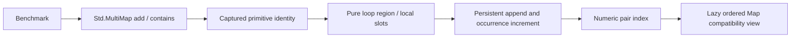

# MultiMap performance repair

## Scope and role transitions

Architect → Runtime Engineer: repair only MultiMap's benchmark path in the
user-selected `pudu-std-bugs-2` checkout on its existing `feature/std-bugs-2` branch.
The user requests a fix and execution, with no review. Existing Call.hs,
Call/Argument.hs, Call/Needs.hs, and Cabal edits are preserved.
Owned responsibility: Std.MultiMap add/contains, new Eval.MultiMap kernels,
their builtin/name/type/installation registration, and corresponding vault pages.
Runtime Engineer → Backend Engineer: additionally own the narrow Compile.hs call
selection for closures proven to forward to these two primitives, with the proof
kept in Eval.MultiMap. Existing Call modules remain untouched.

## Dependency graph and evidence

Benchmark → Std.MultiMap.add/contains → Map methods → ordered tuple comparison
and persistent Sequence append. List is imported but is outside this hot path.
At -O2 the compiled benchmark prints 640000 in 5.67 seconds; construction alone
takes 4.08 seconds. RTS reports 15,604,523,352 allocated bytes.
Resolve repeated lookup/insert traversals and interpreted intermediate calls
with two explicit pure primitives; preserve the API and benchmark workload.

## First iteration validation

- Optimized build with `--ghc-options=-Werror` passed on the installed GHC 9.10.3.
- Exact before/after output oracle passed for both tree and compiled modes: thirteen
  behavior assertions, Decimal spelling `[1.5]`, and E7005/E7008 refusals.
- Focused formatter and whitespace checks passed.
- Full `cabal test all --enable-optimization=2 --test-show-details=direct` passed,
  including all standard-library evaluator agreement fixtures.
- All seven benchmark outputs match between evaluators; MultiMap prints 640000.
- The unchanged `bench/eval.sh` completed after the suite, taking the minimum of
  five runs per evaluator.

| Benchmark | Tree | Compiled |
| --- | ---: | ---: |
| Arrays | 1.36 | 0.62 |
| Calls | 0.55 | 0.31 |
| Iterate | 0.71 | 0.35 |
| Loop | 2.75 | 0.79 |
| Maps | 1.07 | 0.59 |
| MultiMap | 4.83 | 1.70 |
| Records | 2.20 | 0.92 |

The user's MultiMap baseline was 8.15 / 4.99 seconds; the fixed compiled path is
about 2.9 times faster. That iteration’s compiled allocation is 4,397,089,456 bytes, down
from 15,604,523,352 (about 72%). The one-second target remained unmet at that iteration.
No benchmark sizes, script logic, runtime flags, or other benchmark implementations
were changed. The subsequent repair below supersedes those timing results.

## Exact next action

Deliver the validated pending changes to dev, then begin the separate Derive Design delivery.

## Referenced by

[[handoffs/_MOC]] · [[Std MultiMap]] · [[Eval MultiMap]]

## Sub-second follow-up ownership

Backend Engineer → Runtime Engineer: extend the proven-wrapper dispatch into
Call.hs without changing its existing argument/place refactor. Own only that
guard and Eval.MultiMap proof hardening; preserve ordinary dispatch and call
diagnostics. Measure the fixed workload after this first dependency-layer cut.

Runtime Engineer ownership expands to Value.hs's bundled MapValue view and an
unchanged foreign-metadata extraction, plus their Cabal registration and mirrors.
The integer-pair occurrence index is the bounded storage responsibility; generic
Map algorithms and public Std.MultiMap types remain unchanged.

Runtime ownership additionally covers the small Env combinator inlining, bare-name
readPath shortcut, closure proof-cache constructor updates in Eval/Install, and
proof caching during scopeTo. This follows the measured MultiMap scalar-loop floor;
no benchmark, other stdlib implementation, or evaluator mode is changed.

Runtime Engineer → Kernel Engineer: own new Eval.MultiMap.Kernel and the narrow
Loop.hs eligibility hook plus Cabal registration/mirrors. Tree tally measured
9,600,017 name lookups versus 11 compiled; the shared pure MultiMap loop kernel
cuts this repeated dependency-region work without changing program syntax or sizes.

## Dependency layers after repair

Five direct unchanged benchmark runs after static dispatch cuts measured a best
0.882s tree and 0.923s compiled, each printing 640000. Tree's 9,600,017 repeated
name lookups were the remaining dependency-layer bottleneck. Pure native regions
now prepare these reads once. Effects, transfers, declarations and unrelated
calls retain ordinary evaluation; 14 new numeric/loop assertions and exact E7002/
E7005 loop diagnostic spans match the original library in both modes.
The full optimized suite with warnings as errors passes on installed GHC 9.10.3.
The earlier table describes the prior iteration, not the final result.

The final user instruction includes all uncommitted work, so delivery additionally
includes the pre-existing Call/Argument.hs and Call/Needs.hs extraction and its
Cabal registration. Tooling/Release Engineer owns parity documentation for those
pending files; their implementation remains preserved. Call.hs remains below the
500-line default. The full suite passed with these files included.
The user explicitly requests a direct push to dev, with no review or PR.

## Final delivery validation

The unchanged full benchmark script reports 0.92 s tree / 0.90 s compiled for
MultiMap, meeting the requested sub-second target in both modes. All seven
benchmark outputs agree; the workload remains 640000.

| Benchmark | Tree | Compiled |
| --- | ---: | ---: |
| Arrays | 1.20 | 0.63 |
| Calls | 0.48 | 0.31 |
| Iterate | 0.62 | 0.34 |
| Loop | 2.23 | 0.79 |
| Maps | 0.95 | 0.59 |
| MultiMap | 0.92 | 0.90 |
| Records | 1.90 | 0.97 |

`cabal test all --enable-optimization=2 --ghc-options=-Werror
--test-show-details=direct` passes with all pending Call modules included.
All six focused fixtures agree against an independent copy of the original
Std.MultiMap in both modes: 27 behavior assertions, E7005 overflow, E7008
unorderable values, E7005 loop overflow and E7002 step limit. The latter two
retain exact diagnostic output and source spans. Focused formatting and
`git diff --check` pass. Benchmark sources, script and runtime flags are unchanged.
