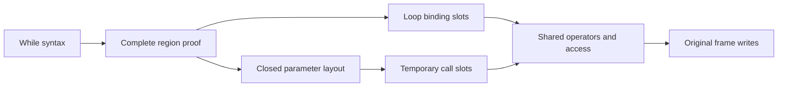

# Eval Loop Kernel

## Purpose and interface

`pureLoop` attempts a kernel for a pure while-expression subgraph.
Captured, proven MultiMap forwarding closures, the two primitive builtin tags,
and closed pure module functions are admitted calls; no call is required.
Return Nothing for unsupported syntax; otherwise an Evaluator Value
executes the kernel. This is a shared intrinsic optimization in both evaluation
modes, not a mode override or use of the general compiled-body cache.

## Algorithm and invariants

Plan literals, bare names, identity borrow, unary/binary scalar operations,
assignment to bare bindings, blocks with expression statements only, and if.
Index expressions evaluate their receiver before their index and delegate to the
shared readIndex boundary. They cannot call user code or observe deferred writes.
Operators delegate to existing applyUnary/combine/expectBool helpers; logical
operators preserve short-circuiting. MultiMap calls require the existing proof
and exactly three arguments. A bare module function may instead pass the closed
body proof below. Effects, lending, declarations, transfers and nested loops
remain excluded. Record construction/member reads are admitted only inside
closed bodies, whose names can only be parameters.
Module callees are resolved once
only when their first segment is unshadowed; assignments cannot target any callee
prefix. Snapshot referenced bindings into temporary runtime slots. Reads/writes
use these local slots, preserving left-to-right evaluation; immutable MultiMap
values and original snapshots remain ordinary values. On successful exit write
only assigned bindings back into their original frames. An abort exposes no state.
Keep the original while condition span for Bool refusal and the existing constant
step-limit boundary. Native wrapper calls retain closure tally and call-depth
entry/exit with their original call and inner primitive spans.

## Failures and negative logic

Unsupported or unresolved regions use the existing loop evaluator. No source
name, benchmark size, key distribution or loop trip count enables the kernel.
No public collection mutation, skipped occurrences, changed workload, or source
rewriting. Effects/callbacks/transfers cannot observe deferred local writes because
these constructs are outside the kernel's admitted region.

## Dependencies and consumers

Requires [[Eval Env]], [[Eval Frame]], [[Eval Match]], [[Eval MultiMap]],
[[Eval Operator]], [[Eval Place]], [[Eval Value]], [[Syntax Tree]], [[Syntax Name]]
and GHC runtime arrays.
Consumed only by [[Eval Loop]].

## Grill Log

- **Q:** Require a MultiMap call in a fully pure scalar subgraph? **A:** No.
  _Rationale:_ the complete-region proof already excludes every observing effect,
  callback, declaration and transfer. Requiring an unrelated primitive leaves
  scalar loops repeating the same safe name/dispatch work. Every primitive call
  still requires the captured primitive proof; closed functions require the
  separate complete-body proof below. _Rejected:_ admitting
  arbitrary functions, benchmark recognition, or partial planning/execution.
- **Q:** Match the supplied benchmark's exact loop? **A:** No; admit the stated
  expression grammar independently of loop size, condition, integers or names.
- **Q:** Change arithmetic or constant-folding policy? **A:** No; use shared
  operators and the original iteration refusal with the same threshold.
- **Q:** Let unsupported behavior run partway through a kernel? **A:** No; validate
  the complete region before any execution and fall back as a whole.
- **Q:** Mutation of collection values? **A:** No; only lexical variable slots are
  written, as in the existing compiled frame. Collection updates stay persistent.

## Referenced by

[[src/Pudu/Eval/_MOC]] · [[src/_MOC]] · [[Eval Loop]] · [[Eval MultiMap]]

## Static dispatch allocation

[[Eval Loop Step]] replaces boxed Yield/Stop outcomes inside the complete region
with a strict unboxed success/refusal channel. Keep the existing whole-region
admission, operator delegation, spans, call tally, scratch ordering/cleanup and
final lexical commit. Only the outer region converts to an ordinary IO result.
Resolved Grill Log: measured loop dispatch allocates gigabytes across scalar and
collection workloads. Test the representation independently of new syntax or
call admission and accept it only with unchanged-workload allocation evidence.

Resolved Grill Log: indexing is a pure shared primitive, so its mere presence must
not reject an otherwise proven whole region. Include receiver/index reads in the
layout. Retain receiver-before-index writes, short-circuiting, the exact error
span and complete fallback for any unsupported child. Validate actual admission,
not only final values that the ordinary walker could also produce.

Prepare statement sequencing and three-argument forwarding once per eligible
region. Identity borrow/dereference nodes reuse their operand code. Bool results
are read directly, with shared expectBool reserved for refusal; integer operators
are selected once with shared checked-result and generic fallback semantics.
Resolved Grill Log: remove transient IO-action/argument-list spines, preserving
left-to-right execution, short-circuiting and every source span.

## Shared compile-time boundaries

[[Compile Time Limits]] supplies the existing depth/iteration constants to both
evaluation and derive residualization. Runtime loop policy and thresholds remain
unchanged. Resolved Grill Log: one phase-neutral declaration prevents nested
compiler expansion and ordinary constant evaluation from drifting apart.

## Dependency layers

While syntax → complete expression plan → temporary lexical slots → shared
scalar/primitive semantics → original-frame commit. Unsupported syntax returns
to the ordinary tree/compiled loop as a whole. The native-call presence bit is
removed from Plan because eligibility no longer depends on it. No value shape,
call proof, diagnostic, step policy or persistent collection representation changes.

Resolved Grill Log: the dependency cut removes repeated syntax/name work only
after all observable boundaries are excluded. Validate success, short-circuit,
condition writes, overflow, bounded constant refusal and effect/transfer fallback.

## Closed function proof and scratch lifetime

Records profiling identifies closure entry and parameter-frame setup as repeated
work beneath loop syntax. Planning a bare, unshadowed module callee admits only
a captured synchronous function with no receiver, defaults or exclusive
parameters, unique parameter names and exactly the supplied arity. Every body
name must resolve in its parameter-only layout. The complete body permits the
existing scalar grammar, expression-only blocks/if, immutable record construction
and member reads. Calls, assignments, declarations, lambdas, transfers and all
other syntax reject the entire loop plan. Free values and recursion therefore
cannot cross the proof boundary. The original MultiMap proof remains separate.

One scratch region follows the loop's binding slots; its size is the maximum
admitted call arity. Evaluate every argument left to right to ordinary immutable
values before installing any parameters. An argument may itself contain an
admitted call: it finishes and releases scratch before the enclosing call writes
its complete argument list. Closed bodies cannot call or create captures, so
scratch cannot escape or be overwritten during the body. Clear each parameter
slot on success and refusal to avoid retaining a previous argument across turns.
Record tags/field order and shorthand use the same erased representation as the
ordinary evaluator; access and arithmetic use shared diagnostic helpers/spans.

Retain the closure-call tally after argument evaluation and the original depth
refusal at the call span. A body with no calls need not materialize a deeper Env:
no admitted operation reads depth. Member dispatch uses the run's shared method
and variant tables, which withCaptured does not replace. Parameter references
use scratch, and free references are rejected, so changing capture frames is
unnecessary. A bare module callee is immutable; writes to its prefix reject the
whole plan. Local/receiver/qualified non-primitive calls retain ordinary dispatch.

Resolved Grill Log:
- **Q:** Treat an effect-free signature as sufficient? **A:** No; prove the
  complete body syntax and every name against its parameter layout.
- **Q:** Install parameters while arguments are still running? **A:** No; nested
  argument calls share scratch, so finish all arguments first.
- **Q:** Keep scratch values until loop exit? **A:** No; clear them after every
  body result to preserve argument lifetime without retaining large values.
- **Q:** Generalize to recursion, callbacks or captured free values? **A:** No;
  these need independent context/depth/observation proofs and stay on fallback.
- **Q:** Bypass errors or call counting? **A:** No; retain the same call boundary,
  operator/access helpers and source spans, and compare an ordinary-call oracle.

The first normal paired run measures Records at 547 ms tree versus 1,688 ms
before, but generic argument-list results add about 40 ms to MultiMap. Prepare
zero/one/two/three-argument sequencing once and invoke its consumer directly;
larger arities retain the general ordered list path. Record field construction
uses the same consumer boundary. Resolved Grill Log: eliminate intermediate
argument-result wrappers, preserving complete evaluation before parameter writes.
